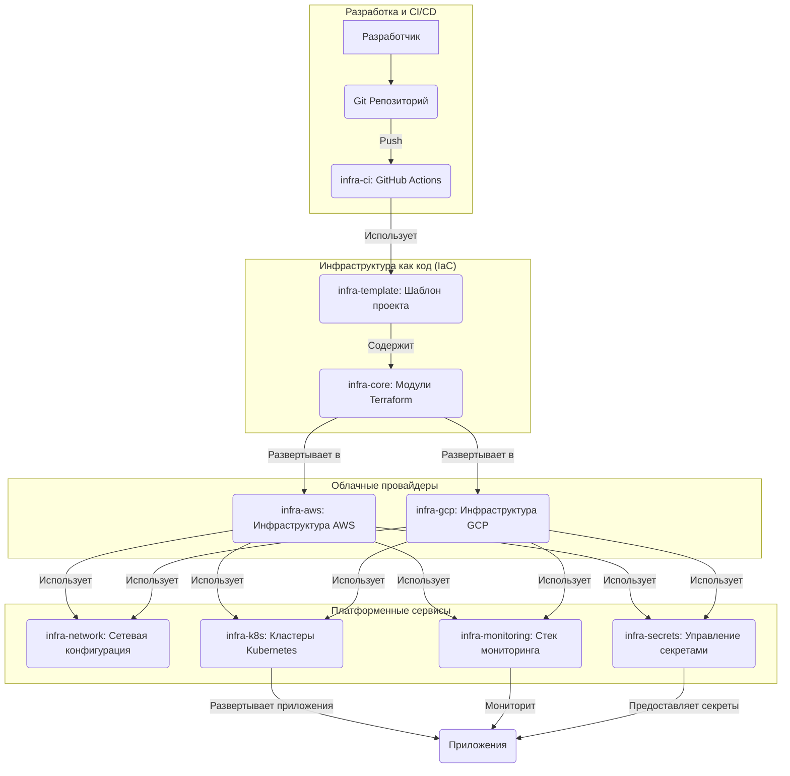

# Добро пожаловать в Infra Docs

Добро пожаловать в полную документацию экосистемы инфраструктуры **v-grand**. Этот набор репозиториев предоставляет готовое production-решение для мультиоблачных развёртываний.

## 📚 Обзор архитектуры

Инфраструктурная экосистема построена на модульной архитектуре, где каждый репозиторий служит определённой цели:

```
┌─────────────────────┐
│    infra-docs       │  ← Документация и примеры
└─────────────────────┘
          │
          ├─► infra-core       (Переиспользуемые модули Terraform)
          ├─► infra-template   (Шаблон проекта)
          ├─► infra-ci         (CI/CD Workflows)
          │
          └─► Прикладные репозитории:
              ├─► template-platform (Этот проект)
              ├─► infra-aws        (Инфраструктура AWS)
              ├─► infra-gcp        (Инфраструктура GCP)
              ├─► infra-network    (Сетевая конфигурация)
              ├─► infra-monitoring (Стек мониторинга)
              ├─► infra-secrets    (Управление секретами)
              └─► infra-k8s        (Кластеры Kubernetes)
```

## 🗂️ Руководство по репозиториям

### Основные библиотеки

| Репозиторий | Назначение | Статус |
|:------------|:-----------|:-------|
| **[infra-core](infra-core.md)** | Переиспользуемые Terraform модули (VM, VPC, DB, K8s, Tailscale) | ✅ Активен |
| **[infra-template](infra-template.md)** | Стандартизированный шаблон для новых проектов | ✅ Активен |
| **[template-platform](template-platform.md)** | Фундаментальный бэкенд-сервис для новых приложений. | ✅ Активен |
| **[infra-ci](infra-ci.md)** | Переиспользуемые GitHub Actions workflows для CI/CD | ✅ Активен |
| **[infra-docs](https://github.com/v-grand/infra-docs)** | Сайт документации (этот сайт) | ✅ Активен |

### Облачная инфраструктура

| Репозиторий | Назначение | Поддерживаемые облака |
|:------------|:-----------|:----------------------|
| **[infra-aws](aws.md)** | Развёртывание инфраструктуры AWS | AWS |
| **[infra-gcp](gcp/index.md)** | Развёртывание инфраструктуры GCP | GCP |
| **[infra-network](infra-network.md)** | VPC, VPN, Tailscale mesh networking | AWS, GCP |

### Платформенные сервисы

| Репозиторий | Назначение | Ключевые технологии |
|:------------|:-----------|:-------------------|
| **[infra-monitoring](infra-monitoring.md)** | Стек наблюдаемости и логирования | Prometheus, Grafana, Loki |
| **[infra-secrets](infra-secrets.md)** | Централизованное управление секретами | Vault, SOPS, GCP Secrets |
| **[infra-k8s](infra-k8s.md)** | Управление Kubernetes кластерами | GKE, EKS, K3s |

## 🚀 Быстрый старт

### Для новых проектов

1. **Клонируйте шаблон:**
   ```bash
   git clone https://github.com/v-grand/infra-template.git my-new-project
   cd my-new-project
   ```

2. **Настройте окружение:**
   ```bash
   cp terraform.tfvars.example terraform.tfvars
   # Отредактируйте terraform.tfvars с вашими настройками
   ```

3. **Разверните:**
   ```bash
   terraform init
   terraform plan
   terraform apply
   ```

### Для существующих проектов

Выберите подходящий репозиторий:

- **Развёртывание AWS** → [infra-aws](aws.md)
- **Развёртывание GCP** → [infra-gcp](gcp/index.md)
- **Kubernetes** → [infra-k8s](infra-k8s.md)
- **Мониторинг** → [infra-monitoring](infra-monitoring.md)

## 📖 Структура документации

- **[Модули Infra Core](infra-core.md)** - Детальная документация модулей
- **[Примеры AWS](examples/aws-dev.md)** - Примеры развёртывания AWS
- **[Руководства GCP](gcp/index.md)** - Документация для GCP
- **[Интеграция Tailscale](tailscale.md)** - Настройка mesh сети
- **[Ноутбуки](../../notebooks/)** - Интерактивные примеры и туториалы

## 🔗 Внешние ресурсы

- [Документация Terraform](https://www.terraform.io/docs)
- [Документация GitHub Actions](https://docs.github.com/en/actions)
- [AWS Well-Architected Framework](https://aws.amazon.com/architecture/well-architected/)
- [Google Cloud Architecture Center](https://cloud.google.com/architecture)

## 🤝 Вклад в проект

Мы приветствуем вклад в проект! Пожалуйста, смотрите руководства по вкладу в отдельных репозиториях.

## 📄 Лицензия

Все репозитории лицензированы под MIT License, если не указано иное.

## Подробная схема архитектуры


