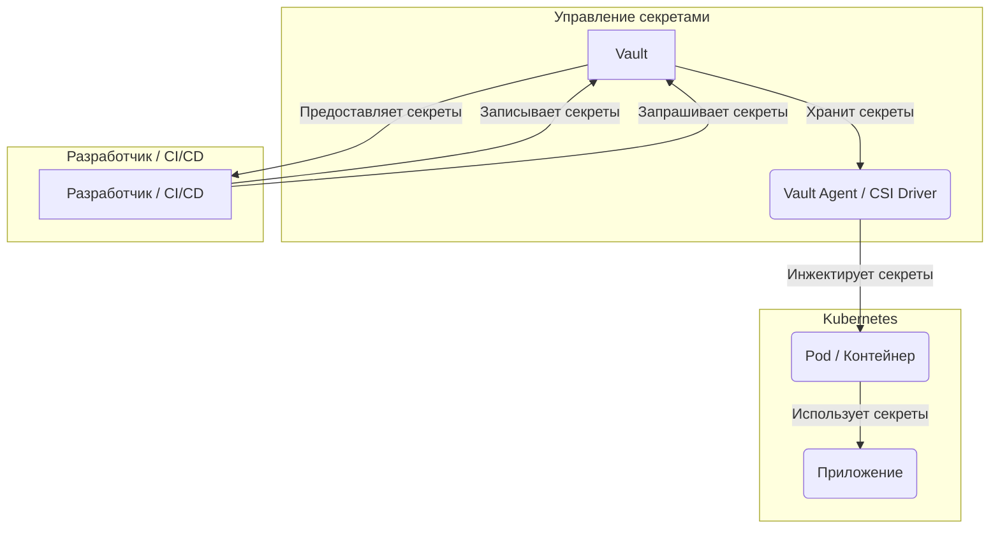

# infra-secrets: Управление секретами

**infra-secrets** обеспечивает централизованное, безопасное управление секретами с использованием HashiCorp Vault, SOPS и облачных менеджеров секретов.

## 🎯 Назначение

Централизация и защита конфиденциальных данных:

- **HashiCorp Vault** - Динамические секреты и шифрование
- **SOPS** - Зашифрованное хранилище файлов с контролем версий
- **GCP Secret Manager** - Нативная интеграция секретов GCP
- **AWS Secrets Manager** - Нативная интеграция секретов AWS

## 📁 Структура репозитория

```
infra-secrets/
├── modules/
│   ├── vault/              # Развертывание HashiCorp Vault
│   ├── sops/               # Интеграция SOPS
│   ├── gcp-secrets/        # GCP Secret Manager
│   └── aws-secrets/        # AWS Secrets Manager
├── environments/
│   ├── dev/
│   │   ├── main.tf
│   │   ├── variables.tf
│   │   ├── terraform.tfvars.example
│   │   ├── backend.tf
│   │   └── secrets.enc.yaml  # Зашифрованные секреты
│   └── prod/
│       └── ...
├── policies/               # Политики Vault
├── scripts/
│   ├── vault-init.sh       # Инициализация Vault
│   ├── sops-encrypt.sh     # Помощник по шифрованию SOPS
│   └── sops-decrypt.sh     # Помощник по расшифровке SOPS
└── README.md
```

## 🔐 Модули

### 1. HashiCorp Vault

Управление секретами корпоративного уровня с динамическими секретами.

**Возможности:**
- Механизм секретов KV (v2)
- Динамические секреты (AWS, GCP, базы данных)
- Механизм транзитного шифрования
- Аутентификация AppRole
- Аутентификация на основе токенов
- Журналирование аудита

**Пример развертывания:**
```hcl
module "vault" {
  source = "github.com/v-grand/infra-secrets//modules/vault"
  
  mode = "ha"  # или "dev" для разработки
  
  # Конфигурация HA
  storage_backend = "consul"
  consul_address  = "consul.example.com:8500"
  
  # Автоматическая разблокировка с GCP KMS
  auto_unseal = true
  kms_project = var.gcp_project
  kms_region  = "global"
  kms_keyring = "vault-keyring"
  kms_key     = "vault-key"
  
  # Конфигурация TLS
  tls_cert_file = "/vault/tls/vault.crt"
  tls_key_file  = "/vault/tls/vault.key"
  
  tags = {
    Environment = "production"
    ManagedBy   = "terraform"
  }
}
```

**Пример политики Vault:**
```hcl
# policies/app-policy.hcl
path "secret/data/app/*" {
  capabilities = ["read", "list"]
}

path "database/creds/app-db" {
  capabilities = ["read"]
}

path "transit/encrypt/app" {
  capabilities = ["update"]
}

path "transit/decrypt/app" {
  capabilities = ["update"]
}
```

### 2. SOPS (Secrets OPerationS)

Шифрование файлов с помощью AWS KMS, GCP KMS или Age.

**Возможности:**
- Шифрование файлов YAML/JSON/ENV
- Частичное шифрование (только значения)
- Поддержка нескольких KMS
- Удобные для Git различия
- Интеграция CI/CD

**Пример использования:**

Создайте `.sops.yaml`:
```yaml
creation_rules:
  - path_regex: environments/prod/.*\.yaml$
    kms: 'arn:aws:kms:us-east-1:123456789:key/12345678-1234-1234-1234-123456789012'
    pgp: 'FBC7B9E2A4F9289AC0C1D4843D16CEE4A27381B4'
  
  - path_regex: environments/dev/.*\.yaml$
    age: 'age1ql3z7hjy54pw3hyww5ayyfg7zqgvc7w3j2elw8zmrj2kg5sfn9aqmcac8p'
```

Зашифруйте секреты:
```bash
# Создайте файл секретов
cat > secrets.yaml << EOF
database:
  host: db.example.com
  username: admin
  password: super-secret-password
  
api_keys:
  stripe: sk_live_xxxxxxxxxxxxx
  sendgrid: SG.xxxxxxxxxxxxx
EOF

# Зашифруйте с помощью SOPS
sops -e secrets.yaml > secrets.enc.yaml

# Закоммитьте зашифрованный файл
git add secrets.enc.yaml
git commit -m "Add encrypted secrets"
```

Расшифруйте и используйте:
```bash
# Расшифруйте в CI/CD
sops -d secrets.enc.yaml > secrets.yaml

# Или экспортируйте как переменные окружения
export $(sops -d --output-type dotenv secrets.enc.yaml)
```

### 3. GCP Secret Manager

Нативное управление секретами GCP.

**Пример:**
```hcl
module "gcp_secrets" {
  source = "github.com/v-grand/infra-secrets//modules/gcp-secrets"
  
  project_id = var.gcp_project_id
  
  secrets = {
    database_password = {
      secret_data = var.database_password
      replication = "automatic"
      
      iam_members = [
        "serviceAccount:app@project.iam.gserviceaccount.com"
      ]
    }
    
    api_key = {
      secret_data = var.api_key
      replication = "automatic"
      rotation_period = "2592000s"  # 30 дней
    }
  }
}
```

**Доступ из приложения:**
```python
from google.cloud import secretmanager

def access_secret(project_id, secret_id, version_id="latest"):
    client = secretmanager.SecretManagerServiceClient()
    name = f"projects/{project_id}/secrets/{secret_id}/versions/{version_id}"
    response = client.access_secret_version(request={"name": name})
    return response.payload.data.decode("UTF-8")

# Использование
db_password = access_secret("my-project", "database_password")
```

### 4. AWS Secrets Manager

Нативное управление секретами AWS.

**Пример:**
```hcl
module "aws_secrets" {
  source = "github.com/v-grand/infra-secrets//modules/aws-secrets"
  
  secrets = {
    database_credentials = {
      secret_string = jsonencode({
        username = "admin"
        password = var.database_password
        host     = "db.example.com"
        port     = 5432
      })
      
      recovery_window_in_days = 30
      rotation_enabled        = true
      rotation_days           = 30
    }
    
    api_key = {
      secret_string = var.api_key
      
      policy = jsonencode({
        Version = "2012-10-17"
        Statement = [
          {
            Effect = "Allow"
            Principal = {
              AWS = "arn:aws:iam::123456789:role/app-role"
            }
            Action   = "secretsmanager:GetSecretValue"
            Resource = "*"
          }
        ]
      })
    }
    
    
  }
}
```

## 🚀 Быстрый старт

### 1. Инициализация Vault

```bash
# Развертывание Vault
cd environments/prod
terraform init
terraform apply

# Инициализация Vault (только в первый раз)
./scripts/vault-init.sh

# Надежно сохраните корневой токен и ключи разблокировки!
```

### 2. Настройка SOPS

```bash
# Сгенерировать ключ Age
age-keygen -o ~/.config/sops/age/keys.txt

# Или используйте существующие ключи KMS
export SOPS_KMS_ARN="arn:aws:kms:us-east-1:123456789:key/xxxxx"
export SOPS_GCP_KMS="projects/my-project/locations/global/keyRings/my-keyring/cryptoKeys/my-key"
```

### 3. Хранение секретов

**Использование Vault:**
```bash
# Записать секрет
vault kv put secret/app/database \
  username=admin \
  password=super-secret

# Прочитать секрет
vault kv get secret/app/database
```

**Использование SOPS:**
```bash
# Зашифровать файл
sops -e config.yaml > config.enc.yaml

# Редактировать зашифрованный файл
sops config.enc.yaml

# Расшифровать
sops -d config.enc.yaml
```

## 🔗 Интеграция CI/CD

### GitHub Actions с SOPS

```yaml
name: Deploy with Secrets
on:
  push:
    branches: [main]

jobs:
  deploy:
    runs-on: ubuntu-latest
    steps:
      - uses: actions/checkout@v3
      
      - name: Установить SOPS
        run: |
          wget https://github.com/mozilla/sops/releases/download/v3.7.3/sops-v3.7.3.linux
          chmod +x sops-v3.7.3.linux
          sudo mv sops-v3.7.3.linux /usr/local/bin/sops
      
      - name: Расшифровать секреты
        env:
          SOPS_AGE_KEY: ${{ secrets.SOPS_AGE_KEY }}
        run: |
          sops -d environments/prod/secrets.enc.yaml > secrets.yaml
      
      - name: Развернуть
        run: |
          terraform init
          terraform apply -auto-approve
```

### Использование Vault в CI/CD

```yaml
name: Deploy with Vault
on:
  push:
    branches: [main]

jobs:
  deploy:
    runs-on: ubuntu-latest
    steps:
      - uses: actions/checkout@v3
      
      - name: Импортировать секреты из Vault
        uses: hashicorp/vault-action@v2
        with:
          url: https://vault.example.com
          token: ${{ secrets.VAULT_TOKEN }}
          secrets: |
            secret/data/app/database username | DATABASE_USERNAME ;
            secret/data/app/database password | DATABASE_PASSWORD ;
            secret/data/app/api apikey | API_KEY
      
      - name: Развернуть
        run: |
          terraform apply -auto-approve
```

## 🔐 Лучшие практики безопасности

1. **Никогда не коммитьте незашифрованные секреты** в систему контроля версий
2. **Регулярно ротируйте секреты** - Внедрите автоматическую ротацию
3. **Используйте принцип наименьших привилегий** - Предоставляйте минимально необходимый доступ
4. **Аудит доступа** - Включите и отслеживайте журналы аудита
5. **Шифрование при передаче** - Всегда используйте TLS/HTTPS
6. **Надежное резервное копирование** - Шифруйте резервные копии Vault
7. **Многофакторная аутентификация** - Включите MFA для доступа к Vault

## 📊 Примеры интеграции

### С infra-aws

```hcl
# Получение секретов из Vault для развертывания AWS
data "vault_generic_secret" "aws_credentials" {
  path = "secret/aws/credentials"
}

module "app_server" {
  source = "github.com/v-grand/infra-core//modules/vm"
  
  # Использование динамических учетных данных
  aws_access_key = data.vault_generic_secret.aws_credentials.data["access_key"]
  aws_secret_key = data.vault_generic_secret.aws_credentials.data["secret_key"]
}
```

### С infra-monitoring

```hcl
# Хранение пароля администратора Grafana в Vault
resource "vault_generic_secret" "grafana_admin" {
  path = "secret/monitoring/grafana"
  
  data_json = jsonencode({
    admin_password = random_password.grafana_admin.result
  })
}

module "monitoring" {
  source = "github.com/v-grand/infra-monitoring//modules/grafana"
  
  admin_password = vault_generic_secret.grafana_admin.data["admin_password"]
}
```

## 📚 Документация

- [HashiCorp Vault](https://www.vaultproject.io/docs)
- [SOPS](https://github.com/mozilla/sops)
- [GCP Secret Manager](https://cloud.google.com/secret-manager/docs)
- [AWS Secrets Manager](https://docs.aws.amazon.com/secretsmanager/)

## 🔗 Связанные репозитории

- [infra-ci](infra-ci.md) - Интеграция CI/CD
- [infra-core](infra-core.md) - Модули инфраструктуры
- [infra-aws](aws.md) - Интеграция AWS
- [infra-gcp](gcp/index.md) - Интеграция GCP

## Схема потоков данных: Секреты от Vault до приложения в Kubernetes


